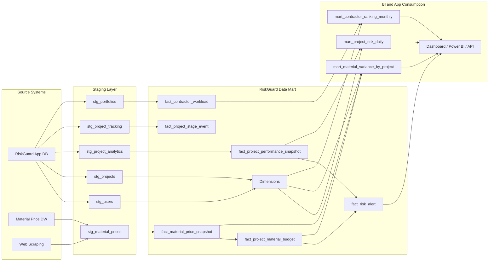

# RiskGuard Data Mart และ Data Catalog Design

เอกสารนี้ออกแบบจากการอ่านไฟล์ `DW_BI-03_Logbook.pdf` และ `จุลบทที่1-5-4 - สำเนา.pdf` ร่วมกับโครงสร้างระบบ RiskGuard ปัจจุบันในโปรเจกต์นี้

## 1. ความเข้าใจจากเอกสาร

หัวข้อจุลนิพนธ์คือการพัฒนาระบบคลังข้อมูลและ BI เพื่อบริหารความเสี่ยงด้านต้นทุนและเวลาในโครงการก่อสร้าง โดยใช้ข้อมูลจัดซื้อจัดจ้างเป็นกรณีศึกษา จุดสำคัญที่ระบบต้องรองรับคือ:

- รวมข้อมูลกระจัดกระจายให้เป็น Single Source of Truth
- วิเคราะห์ความเสี่ยงด้านต้นทุนและเวลาโดยใช้ Earned Value Management
- แสดง KPI หลัก เช่น CPI และ SPI ผ่าน Dashboard
- เปรียบเทียบต้นทุนจริงหรือราคาประเมินกับราคากลาง/ราคาตลาดของวัสดุก่อสร้าง
- แจ้งเตือน Early Warning เมื่อโครงการมีแนวโน้มเกินงบหรือล่าช้า
- รองรับ workflow ผู้ว่าจ้างเลือกผู้รับเหมา, ส่งรายละเอียดงาน, ผู้รับเหมาประเมินราคา, สร้างงาน, ติดตามงาน
- รองรับการจัดอันดับผู้รับเหมาจาก workload, มูลค่างาน, ประสบการณ์ และผลงาน

เอกสารเดิมมีแนวคิด Star Schema โดยมี `Fact_Workload`, `Dimension_User`, `Dimension_Project`, `Dimension_Time` เป็นแกนหลัก แต่จากระบบจริงและเป้าหมาย BI ควรขยาย Data Mart เป็นหลาย fact table เพื่อให้ตอบโจทย์ต้นทุน เวลา วัสดุ การติดตามงาน และ ranking ได้ครบกว่าเดิม

## 2. ขอบเขต Data Mart ที่เสนอ

Data Mart หลักของ RiskGuard แบ่งเป็น 4 กลุ่มวิเคราะห์:

| Data Mart | เป้าหมาย | ผู้ใช้หลัก | ตัวอย่างคำถามที่ตอบได้ |
|---|---|---|---|
| Project Performance Mart | วิเคราะห์ CPI, SPI, EVM และสถานะโครงการ | Project Manager, Executive, Contractor | โครงการไหนเกินงบหรือล่าช้า |
| Procurement and Material Mart | วิเคราะห์ราคาวัสดุ แผนงบวัสดุ และราคาตลาด | Contractor, Project Manager | วัสดุหมวดไหนทำให้ต้นทุนเบี่ยงเบน |
| Contractor Ranking Mart | วิเคราะห์ workload, portfolio, มูลค่างาน และประสบการณ์ | Employer, Admin | ผู้รับเหมาคนใดเหมาะกับงานและมีผลงานสูง |
| Risk Alert Mart | เก็บผลการประเมินความเสี่ยงและเหตุแจ้งเตือน | Executive, Contractor | เหตุเตือนใดต้องแก้ก่อน และเกิดจาก metric ไหน |

## 3. แหล่งข้อมูลต้นทาง

| Source | ตาราง/ข้อมูล | ใช้ทำอะไร | สถานะในระบบ |
|---|---|---|---|
| App DB | `users`, `user_profiles` | ผู้ใช้, บทบาท, โปรไฟล์, company, tax id | มีอยู่แล้ว |
| App DB | `projects` | โครงการ, งบ, owner, contractor, วันที่เริ่ม/จบ | มีอยู่แล้ว |
| App DB | `project_analytics` | EV, AC, PV, CPI, SPI รายช่วงเวลา | มีอยู่แล้ว |
| App DB | `project_tracking` | stage, status, proof image, awaiting confirmation | มีอยู่แล้ว |
| App DB | `portfolios` | ผลงานผู้รับเหมา, ประเภทงาน, rating, experience | มีอยู่แล้ว |
| App DB | `messages` | การสื่อสารและไฟล์แนบ | มีอยู่แล้ว แต่ควรใช้เชิงสถิติเท่านั้น |
| App DB | `project_material_budgets` | งบวัสดุรายโครงการ | มี schema แล้ว แต่ยังไม่มีข้อมูล |
| Material DW | `staging_material_prices`, `fact_material_prices`, `dim_product`, `dim_date` | ราคาวัสดุจาก web scraping | มีอยู่แล้ว |
| Web scraping | ราคาวัสดุจากตลาด เช่น OneStockHome/GlobalHouse | market benchmark | มี pipeline เริ่มต้นแล้ว |

## 4. Data Mart Architecture



## 5. Star Schema ที่เสนอ

```mermaid
erDiagram
    dim_date ||--o{ fact_project_performance_snapshot : date_key
    dim_project ||--o{ fact_project_performance_snapshot : project_key
    dim_user ||--o{ fact_project_performance_snapshot : owner_key
    dim_contractor ||--o{ fact_project_performance_snapshot : contractor_key

    dim_date ||--o{ fact_material_price_snapshot : date_key
    dim_material ||--o{ fact_material_price_snapshot : material_key
    dim_material_category ||--o{ fact_material_price_snapshot : category_key
    dim_source ||--o{ fact_material_price_snapshot : source_key

    dim_project ||--o{ fact_project_material_budget : project_key
    dim_material ||--o{ fact_project_material_budget : material_key
    dim_material_category ||--o{ fact_project_material_budget : category_key
    dim_date ||--o{ fact_project_material_budget : estimate_date_key

    dim_project ||--o{ fact_project_stage_event : project_key
    dim_project_stage ||--o{ fact_project_stage_event : stage_key
    dim_date ||--o{ fact_project_stage_event : event_date_key

    dim_contractor ||--o{ fact_contractor_workload : contractor_key
    dim_project ||--o{ fact_contractor_workload : project_key
    dim_date ||--o{ fact_contractor_workload : month_key

    dim_project ||--o{ fact_risk_alert : project_key
    dim_risk_type ||--o{ fact_risk_alert : risk_type_key
    dim_date ||--o{ fact_risk_alert : alert_date_key
```



## 6. Grain ของ Fact Table

| Fact Table | Grain | ใช้ตอบโจทย์ |
|---|---|---|
| `fact_project_performance_snapshot` | 1 แถวต่อ 1 โครงการต่อ 1 วัน/สัปดาห์ snapshot | CPI, SPI, CV, SV, EAC, TCPI, trend |
| `fact_material_price_snapshot` | 1 แถวต่อ 1 วัสดุ/สินค้า ต่อ 1 source ต่อ 1 วันที่เก็บราคา | ราคาตลาด, price trend, market benchmark |
| `fact_project_material_budget` | 1 แถวต่อ 1 รายการวัสดุที่ผูกกับโครงการ | แผนงบวัสดุเทียบราคาปัจจุบัน/ราคาจริง |
| `fact_project_stage_event` | 1 แถวต่อ 1 เหตุการณ์เปลี่ยนสถานะ stage ของโครงการ | ความล่าช้าราย stage, evidence, approval |
| `fact_contractor_workload` | 1 แถวต่อ 1 ผู้รับเหมา-โครงการ-เดือน | ranking, workload count, project value |
| `fact_risk_alert` | 1 แถวต่อ 1 alert ต่อ project ต่อวันที่ประเมิน | Early warning, severity, action recommendation |

## 7. Dimension Tables

### 7.1 `dim_date`

ใช้วิเคราะห์ตามวัน เดือน ไตรมาส ปี และรอบการติดตาม

| Field | Type | Description |
|---|---|---|
| `date_key` | integer PK | วันที่รูปแบบ YYYYMMDD |
| `full_date` | date | วันที่จริง |
| `day` | integer | วัน |
| `month` | integer | เดือน |
| `month_name_th` | text | ชื่อเดือนภาษาไทย |
| `quarter` | integer | ไตรมาส |
| `year` | integer | ปี |
| `week_of_year` | integer | สัปดาห์ของปี |
| `is_month_end` | boolean | เป็นวันสิ้นเดือนหรือไม่ |

### 7.2 `dim_project`

| Field | Type | Description |
|---|---|---|
| `project_key` | integer PK | surrogate key |
| `project_id` | integer | id จาก App DB |
| `project_title` | text | ชื่อโครงการ |
| `project_type` | text | ประเภทโครงการ เช่น บ้านพักอาศัย/อาคารสำนักงาน/ต่อเติม |
| `budget_amount` | decimal | งบประมาณรวม |
| `location` | text | สถานที่ |
| `start_date` | date | วันที่เริ่ม |
| `end_date` | date | วันที่สิ้นสุดตามแผน |
| `status` | text | planning, in_progress, completed |
| `owner_id` | integer | ผู้ว่าจ้าง |
| `contractor_id` | integer | ผู้รับเหมา |
| `valid_from` | datetime | เริ่มมีผลสำหรับ SCD |
| `valid_to` | datetime | สิ้นสุดการมีผล |
| `is_current` | boolean | record ปัจจุบัน |

หมายเหตุ: ใช้ SCD Type 2 สำหรับ field ที่อาจเปลี่ยนและมีผลกับการวิเคราะห์ เช่น budget, status, contractor

### 7.3 `dim_user`

| Field | Type | Description |
|---|---|---|
| `user_key` | integer PK | surrogate key |
| `user_id` | integer | id จาก App DB |
| `email_hash` | text | hash ของ email เพื่อหลีกเลี่ยงการเปิดเผย PII |
| `full_name_masked` | text | ชื่อแบบ masked สำหรับ dashboard ทั่วไป |
| `role` | text | employer, contractor, admin |
| `otp_verified` | boolean | สถานะยืนยันตัวตน |
| `is_active` | boolean | สถานะบัญชี |
| `company_name` | text | บริษัท |
| `profile_completed` | boolean | โปรไฟล์ครบหรือไม่ |

### 7.4 `dim_contractor`

แยกจาก `dim_user` เพื่อรองรับข้อมูลเชิง ranking และ portfolio

| Field | Type | Description |
|---|---|---|
| `contractor_key` | integer PK | surrogate key |
| `contractor_id` | integer | user id ของผู้รับเหมา |
| `contractor_name` | text | ชื่อผู้รับเหมา/บริษัท |
| `contractor_type` | text | ประเภทงานที่รับ |
| `service_area` | text | พื้นที่ให้บริการ |
| `experience_years` | integer | ประสบการณ์ |
| `rating_score` | decimal | คะแนนรีวิว |
| `review_count` | integer | จำนวนรีวิว |
| `portfolio_count` | integer | จำนวนผลงาน |
| `profile_completed` | boolean | โปรไฟล์ครบหรือไม่ |

### 7.5 `dim_material_category`

| Field | Type | Description |
|---|---|---|
| `category_key` | integer PK | surrogate key |
| `category_id` | integer | id จาก App DB |
| `category_code` | text | Steel, Cement, Bricks, Wood, Stone |
| `category_name_th` | text | ชื่อหมวดภาษาไทย |
| `description` | text | คำอธิบาย |

### 7.6 `dim_material`

| Field | Type | Description |
|---|---|---|
| `material_key` | integer PK | surrogate key |
| `material_id` | integer | id จาก App DB หรือ Product_Key จาก DW |
| `product_name` | text | ชื่อวัสดุ/สินค้า |
| `brand_name` | text | ยี่ห้อ |
| `model_code` | text | รุ่น/รหัสสินค้า |
| `category_key` | integer FK | หมวดวัสดุ |
| `unit` | text | หน่วย |
| `product_url` | text | URL สินค้า |
| `natural_key` | text | key ธรรมชาติ เช่น product_url |

### 7.7 `dim_source`

| Field | Type | Description |
|---|---|---|
| `source_key` | integer PK | surrogate key |
| `source_name` | text | เช่น OneStockHome, GlobalHouse |
| `source_type` | text | e-commerce, price index, internal |
| `source_url` | text | URL หลัก |
| `trust_level` | text | high, medium, low |
| `refresh_frequency` | text | daily, weekly, monthly |

### 7.8 `dim_project_stage`

| Field | Type | Description |
|---|---|---|
| `stage_key` | integer PK | surrogate key |
| `stage_name` | text | ชื่อ stage |
| `stage_order` | integer | ลำดับขั้น |
| `stage_group` | text | planning, execution, inspection, closeout |
| `requires_evidence` | boolean | ต้องมีหลักฐานภาพ/ไฟล์หรือไม่ |

### 7.9 `dim_risk_type`

| Field | Type | Description |
|---|---|---|
| `risk_type_key` | integer PK | surrogate key |
| `risk_code` | text | CPI_LOW, SPI_LOW, MATERIAL_VARIANCE, TCPI_HIGH |
| `risk_name_th` | text | ชื่อความเสี่ยงภาษาไทย |
| `metric_name` | text | CPI, SPI, Variance, TCPI |
| `default_warning_threshold` | decimal | เกณฑ์เตือน |
| `default_critical_threshold` | decimal | เกณฑ์วิกฤต |
| `recommended_action` | text | แนวทางแก้ไข |

## 8. Fact Tables

### 8.1 `fact_project_performance_snapshot`

ใช้เป็น fact หลักของ Project Performance Mart

| Field | Type | Description |
|---|---|---|
| `snapshot_key` | integer PK | surrogate key |
| `project_key` | integer FK | โครงการ |
| `owner_key` | integer FK | ผู้ว่าจ้าง |
| `contractor_key` | integer FK | ผู้รับเหมา |
| `date_key` | integer FK | วันที่ snapshot |
| `pv_amount` | decimal | Planned Value |
| `ev_amount` | decimal | Earned Value |
| `ac_amount` | decimal | Actual Cost |
| `bac_amount` | decimal | Budget at Completion |
| `cpi` | decimal | EV / AC |
| `spi` | decimal | EV / PV |
| `cost_variance` | decimal | EV - AC |
| `schedule_variance` | decimal | EV - PV |
| `eac_amount` | decimal | Estimate at Completion |
| `vac_amount` | decimal | BAC - EAC |
| `tcpi` | decimal | To Complete Performance Index |
| `percent_complete` | decimal | EV / BAC |
| `days_remaining` | integer | จำนวนวันเหลือถึง end_date |
| `risk_level` | text | normal, warning, critical |

สูตรที่แนะนำ:

```text
CPI = EV / AC
SPI = EV / PV
CV = EV - AC
SV = EV - PV
BAC = project_budget
EAC = BAC / CPI
VAC = BAC - EAC
TCPI = (BAC - EV) / (BAC - AC)
Percent Complete = EV / BAC
```

### 8.2 `fact_material_price_snapshot`

| Field | Type | Description |
|---|---|---|
| `price_snapshot_key` | integer PK | surrogate key |
| `material_key` | integer FK | วัสดุ |
| `category_key` | integer FK | หมวดวัสดุ |
| `source_key` | integer FK | แหล่งข้อมูล |
| `date_key` | integer FK | วันที่เก็บราคา |
| `price_thb` | decimal | ราคาที่ scrape/โหลดมา |
| `previous_price_thb` | decimal | ราคาก่อนหน้า |
| `price_change_thb` | decimal | ส่วนต่างราคา |
| `price_change_pct` | decimal | % การเปลี่ยนแปลง |
| `is_outlier` | boolean | ราคาผิดปกติหรือไม่ |
| `load_batch_id` | text | batch ETL |

### 8.3 `fact_project_material_budget`

| Field | Type | Description |
|---|---|---|
| `material_budget_key` | integer PK | surrogate key |
| `project_key` | integer FK | โครงการ |
| `material_key` | integer FK | วัสดุ |
| `category_key` | integer FK | หมวดวัสดุ |
| `estimate_date_key` | integer FK | วันที่ประเมินราคา |
| `planned_quantity` | decimal | ปริมาณตามแผน |
| `planned_unit_price` | decimal | ราคาต่อหน่วยตอนวางแผน |
| `planned_cost` | decimal | planned_quantity x planned_unit_price |
| `market_unit_price` | decimal | ราคาตลาดล่าสุดหรือราคาเฉลี่ย |
| `market_cost` | decimal | planned_quantity x market_unit_price |
| `actual_unit_price` | decimal | ราคาจริงถ้ามีข้อมูลจัดซื้อ |
| `actual_cost` | decimal | ต้นทุนจริง |
| `cost_variance` | decimal | actual/market cost - planned cost |
| `cost_variance_pct` | decimal | cost_variance / planned_cost |
| `risk_level` | text | normal, warning, critical |

### 8.4 `fact_project_stage_event`

| Field | Type | Description |
|---|---|---|
| `stage_event_key` | integer PK | surrogate key |
| `project_key` | integer FK | โครงการ |
| `stage_key` | integer FK | stage |
| `event_date_key` | integer FK | วันที่เกิดเหตุการณ์ |
| `status` | text | pending, in_progress, awaiting_confirm, approved, rejected, completed |
| `planned_start_date` | date | วันที่เริ่มตามแผน |
| `planned_end_date` | date | วันที่จบตามแผน |
| `actual_start_date` | date | วันที่เริ่มจริง |
| `actual_end_date` | date | วันที่จบจริง |
| `delay_days` | integer | จำนวนวันล่าช้า |
| `evidence_count` | integer | จำนวนหลักฐานแนบ |
| `awaiting_confirm_flag` | boolean | รอยืนยันหรือไม่ |

### 8.5 `fact_contractor_workload`

ขยายจาก `Fact_Workload` ในเอกสารเดิม

| Field | Type | Description |
|---|---|---|
| `workload_key` | integer PK | surrogate key |
| `contractor_key` | integer FK | ผู้รับเหมา |
| `project_key` | integer FK | โครงการ |
| `month_key` | integer FK | เดือนที่นับ workload |
| `project_value` | decimal | มูลค่าโครงการ |
| `workload_count` | integer | จำนวนงานที่รับ |
| `active_project_count` | integer | จำนวนงาน active |
| `completed_project_count` | integer | จำนวนงานเสร็จ |
| `avg_cpi` | decimal | ค่า CPI เฉลี่ยของงาน |
| `avg_spi` | decimal | ค่า SPI เฉลี่ยของงาน |
| `on_time_rate` | decimal | สัดส่วนงานตรงเวลา |
| `budget_control_rate` | decimal | สัดส่วนงานไม่เกินงบ |
| `ranking_score` | decimal | คะแนนรวมสำหรับ ranking |

ตัวอย่างสูตร ranking:

```text
ranking_score =
  (0.30 x normalized_rating)
  + (0.25 x normalized_completed_project_count)
  + (0.20 x normalized_project_value)
  + (0.15 x normalized_experience_years)
  + (0.10 x normalized_on_time_rate)
```

### 8.6 `fact_risk_alert`

| Field | Type | Description |
|---|---|---|
| `alert_key` | integer PK | surrogate key |
| `project_key` | integer FK | โครงการ |
| `risk_type_key` | integer FK | ประเภทความเสี่ยง |
| `alert_date_key` | integer FK | วันที่แจ้งเตือน |
| `metric_value` | decimal | ค่า metric ที่ตรวจพบ |
| `warning_threshold` | decimal | เกณฑ์ warning |
| `critical_threshold` | decimal | เกณฑ์ critical |
| `severity_score` | decimal | คะแนนความรุนแรง 0-100 |
| `risk_level` | text | normal, warning, critical |
| `alert_message` | text | ข้อความแจ้งเตือน |
| `recommended_action` | text | แนวทางแก้ไข |
| `status` | text | open, acknowledged, resolved |
| `resolved_at` | datetime | เวลาปิด alert |

## 9. Data Catalog

### 9.1 Catalog ระดับ Dataset

| Dataset | Business Name | Owner | Steward | Source | Refresh | Sensitivity | Quality SLA |
|---|---|---|---|---|---|---|---|
| `dim_project` | ข้อมูลโครงการ | Product Owner | DW Manager | `projects` | daily/incremental | internal | 99% complete |
| `dim_user` | ข้อมูลผู้ใช้ | Admin | DW Manager | `users`, `user_profiles` | daily | confidential/PII | PII masked |
| `dim_contractor` | ข้อมูลผู้รับเหมา | Marketplace Owner | DW Manager | `users`, `portfolios` | daily | internal | no duplicate contractor |
| `dim_material` | ข้อมูลวัสดุ | Data Analyst | DW Manager | `materials`, `dim_product` | daily | public/internal | product_url unique |
| `fact_project_performance_snapshot` | Snapshot ประสิทธิภาพโครงการ | Project Manager | Data Analyst | `project_analytics`, `projects` | daily/weekly | internal | CPI/SPI valid |
| `fact_material_price_snapshot` | ราคาวัสดุตามเวลา | Data Analyst | DW Manager | Material DW/Web scraping | daily | public | outlier checked |
| `fact_project_material_budget` | งบวัสดุรายโครงการ | Contractor | Project Manager | `project_material_budgets` | on change | internal | planned_cost consistent |
| `fact_project_stage_event` | เหตุการณ์ติดตาม stage | Project Manager | Contractor | `project_tracking` | near real-time/daily | internal | status valid |
| `fact_contractor_workload` | workload และ ranking | Marketplace Owner | Data Analyst | `projects`, `portfolios` | monthly/daily | internal | ranking reproducible |
| `fact_risk_alert` | ประวัติแจ้งเตือนความเสี่ยง | Executive | Data Analyst | computed from marts | daily | internal | no orphan alert |

### 9.2 Business Glossary

| Term | Definition | Formula/Rule |
|---|---|---|
| Project | งานก่อสร้างที่ผู้ว่าจ้างสร้างและผู้รับเหมารับผิดชอบ | มาจาก `projects` |
| Procurement Data | ข้อมูลจัดซื้อจัดจ้าง วัสดุ ราคา แผนงบ และข้อมูลส่งมอบ | ใช้กับ Material/Procurement Mart |
| EV | Earned Value มูลค่างานที่ทำเสร็จแล้ว | จาก progress หรือ `project_analytics.ev` |
| PV | Planned Value มูลค่างานตามแผน | จาก baseline plan หรือ `project_analytics.pv` |
| AC | Actual Cost ต้นทุนจริง | จากค่าใช้จ่ายจริงหรือ `project_analytics.ac` |
| CPI | Cost Performance Index | `EV / AC` |
| SPI | Schedule Performance Index | `EV / PV` |
| CV | Cost Variance | `EV - AC` |
| SV | Schedule Variance | `EV - PV` |
| BAC | Budget at Completion | งบโครงการรวม |
| EAC | Estimate at Completion | `BAC / CPI` |
| VAC | Variance at Completion | `BAC - EAC` |
| TCPI | To Complete Performance Index | `(BAC - EV) / (BAC - AC)` |
| Material Variance | ส่วนต่างต้นทุนวัสดุเทียบแผน | `(actual_or_market_cost - planned_cost) / planned_cost` |
| Early Warning | alert เมื่อ metric ต่ำ/สูงกว่า threshold | CPI/SPI/Variance/TCPI |
| Workload Count | จำนวนงานที่ผู้รับเหมารับในช่วงเวลา | count project per contractor/month |
| Ranking Score | คะแนนรวมเพื่อจัดอันดับผู้รับเหมา | weighted score จาก rating, workload, value, experience, on-time |

### 9.3 Data Quality Rules

| Rule ID | Dataset | Rule | Severity |
|---|---|---|---|
| DQ-001 | `dim_project` | `project_id` ต้องไม่ซ้ำและไม่เป็น null | critical |
| DQ-002 | `dim_project` | `end_date` ต้องมากกว่าหรือเท่ากับ `start_date` | critical |
| DQ-003 | `fact_project_performance_snapshot` | `ev_amount`, `ac_amount`, `pv_amount` ต้องไม่ติดลบ | critical |
| DQ-004 | `fact_project_performance_snapshot` | ถ้า `ac_amount = 0` ให้ `cpi` เป็น null ไม่หารศูนย์ | critical |
| DQ-005 | `fact_project_performance_snapshot` | ถ้า `pv_amount = 0` ให้ `spi` เป็น null ไม่หารศูนย์ | critical |
| DQ-006 | `fact_material_price_snapshot` | `price_thb` ต้องมากกว่า 0 และอยู่ในช่วงที่กำหนดตาม category | warning/critical |
| DQ-007 | `fact_material_price_snapshot` | `material_key + source_key + date_key` ต้องไม่ซ้ำ | critical |
| DQ-008 | `fact_project_material_budget` | `planned_cost = planned_quantity x planned_unit_price` | critical |
| DQ-009 | `fact_project_stage_event` | `status` ต้องอยู่ใน allowed values | critical |
| DQ-010 | `fact_risk_alert` | alert ต้องมี `project_key`, `risk_type_key`, `alert_date_key` | critical |
| DQ-011 | `dim_user` | PII เช่น email, phone, tax id ต้อง masked/hash ใน mart | critical |
| DQ-012 | `dim_contractor` | `experience_years` ต้องไม่ติดลบ | warning |

### 9.4 Data Lineage

| Target | Source | Transform |
|---|---|---|
| `dim_project` | `projects` | map project id, budget, dates, status, owner, contractor |
| `dim_user` | `users`, `user_profiles` | hash email, mask name, join profile |
| `dim_contractor` | `users`, `portfolios` | filter role contractor, parse service data, aggregate portfolio |
| `dim_material` | `materials`, `dim_product` | normalize product name, map category, deduplicate by product_url |
| `fact_project_performance_snapshot` | `project_analytics`, `projects` | calculate CPI, SPI, CV, SV, EAC, TCPI, risk level |
| `fact_material_price_snapshot` | `fact_material_prices`, `staging_material_prices` | join product/date/source, calculate price change and outlier |
| `fact_project_material_budget` | `project_material_budgets`, material price mart | calculate planned, market, actual, variance |
| `fact_project_stage_event` | `project_tracking` | map stage status, calculate delay days |
| `fact_contractor_workload` | `projects`, `project_analytics`, `portfolios` | aggregate monthly workload and ranking score |
| `fact_risk_alert` | performance/material/stage facts | evaluate threshold and create alert |

## 10. Mart Views สำหรับ Dashboard/API

| View | Purpose | Main Fields |
|---|---|---|
| `mart_project_risk_daily` | สรุปความเสี่ยงรายโครงการรายวัน | project, date, CPI, SPI, CV, SV, EAC, TCPI, risk_level |
| `mart_material_variance_by_project` | วิเคราะห์วัสดุที่ทำให้ต้นทุนเบี่ยงเบน | project, category, planned_cost, market_cost, variance_pct |
| `mart_contractor_ranking_monthly` | จัดอันดับผู้รับเหมา | contractor, month, workload, project_value, rating, ranking_score |
| `mart_current_alerts` | alert ที่ยังเปิดอยู่ | project, risk_type, metric, level, message, action |
| `mart_executive_summary` | หน้า dashboard ผู้บริหาร | total projects, projects at risk, avg CPI/SPI, total variance |

## 11. Threshold และ Risk Logic

ค่าเริ่มต้นที่สอดคล้องกับระบบปัจจุบัน:

| Metric | Normal | Warning | Critical | ความหมาย |
|---|---|---|---|---|
| CPI | `>= 0.95` | `< 0.95` | `< 0.85` | ต่ำกว่า 1 คือเริ่มใช้เงินเกินประสิทธิภาพ |
| SPI | `>= 0.95` | `< 0.95` | `< 0.85` | ต่ำกว่า 1 คือเริ่มล่าช้ากว่าแผน |
| Material Variance % | `abs <= 10%` | `abs > 10%` | `abs > 20%` | วัสดุเบี่ยงเบนจากแผน |
| TCPI | `<= 1.10` | `> 1.10` | `> 1.25` | ต้องเพิ่มประสิทธิภาพสูงเพื่อจบในงบ |
| Delay Days | `<= 0` | `1-7 days` | `> 7 days` | stage ล่าช้า |

Overall risk rule:

```text
if any critical alert exists:
    overall_risk = "critical"
elif any warning alert exists:
    overall_risk = "warning"
else:
    overall_risk = "normal"
```

## 12. ETL/ELT Flow ที่แนะนำ

1. Extract
   - ดึงข้อมูลจาก `riskguard.db`
   - ดึงข้อมูลราคาวัสดุจาก `riskguard_dw.db`
   - รับข้อมูลใหม่จาก web scraping เข้าตาราง staging

2. Transform
   - normalize วันที่เป็น `date_key`
   - map category วัสดุเป็น Steel, Cement, Bricks, Wood, Stone
   - deduplicate วัสดุด้วย `product_url` หรือ natural key
   - parse ข้อมูล portfolio ที่อยู่ใน description ให้เป็น field แยก เช่น service_type, base_price, location, rating, review_count
   - calculate CPI/SPI/variance/ranking/risk level
   - mask/hash PII ก่อนโหลดเข้า mart

3. Load
   - โหลด dimension ก่อน fact
   - ใช้ incremental load จาก `updated_at`, `collection_date`, `timestamp` หรือ max key
   - เก็บ `load_batch_id`, `loaded_at`, `source_system`

4. Validate
   - run DQ checks
   - reject/quarantine records ที่ critical fail
   - log summary ของจำนวน inserted/updated/rejected

## 13. Security และ Privacy

- ไม่ควรนำ email, เบอร์โทร, tax id, chat content และไฟล์แนบเข้า Data Mart แบบ raw
- `dim_user` ควรใช้ `email_hash`, `full_name_masked` และ role แทนข้อมูลระบุตัวตนเต็ม
- `messages` ควรใช้เป็น `fact_message_activity` เชิงสถิติเท่านั้น เช่น จำนวนข้อความ, response time, file_count ไม่ดึงเนื้อหาแชท
- Dashboard ผู้ว่าจ้างควรเห็นเฉพาะข้อมูลโครงการของตน
- Dashboard ผู้รับเหมาควรเห็นเฉพาะงานที่รับผิดชอบ
- Admin/Data Analyst เห็นข้อมูล aggregate ได้ แต่ข้อมูล PII ต้อง masked

## 14. สิ่งที่ควรปรับจากเอกสารเดิม

| ประเด็นในเอกสารเดิม | ข้อเสนอปรับปรุง |
|---|---|
| มี `Fact_Workload` เป็น fact หลักเพียงตัวเดียว | เพิ่ม fact สำหรับ EVM, Material Price, Material Budget, Stage Event, Risk Alert |
| `Dimension_User` เก็บผู้รับเหมาอย่างเดียว | แยก `dim_user` สำหรับ account และ `dim_contractor` สำหรับ ranking/portfolio |
| Data Mart ยังไม่ชัดเรื่องราคาวัสดุจาก web scraping | เพิ่ม `fact_material_price_snapshot` และ `dim_source` |
| CPI/SPI อยู่ในเนื้อหา แต่ยังไม่ผูกเป็น fact หลัก | ใช้ `fact_project_performance_snapshot` เป็น fact หลักของ Dashboard |
| Early Warning ยังเป็นแนวคิด | ทำเป็น `fact_risk_alert` เพื่อเก็บประวัติ alert และสถานะการแก้ไข |
| Data Catalog ยังไม่มี | เพิ่ม dataset catalog, glossary, quality rules, lineage, sensitivity |

## 15. Roadmap การทำจริงในโปรเจกต์

### Phase 1: Data Mart MVP

- สร้าง schema `dim_date`, `dim_project`, `dim_user`, `dim_contractor`, `dim_material`, `dim_material_category`, `dim_source`
- สร้าง fact หลัก `fact_project_performance_snapshot`, `fact_material_price_snapshot`, `fact_project_material_budget`
- ทำ mart views สำหรับ dashboard ปัจจุบัน

### Phase 2: Risk and Tracking

- เพิ่ม `fact_project_stage_event`
- เพิ่ม `dim_risk_type` และ `fact_risk_alert`
- ทำ ETL สำหรับประเมิน warning/critical ตาม threshold
- ปรับ API dashboard ให้อ่านจาก mart views แทน mock logic

### Phase 3: Ranking and Predictive Analytics

- เพิ่ม `fact_contractor_workload`
- คำนวณ ranking score รายเดือน
- เตรียม feature dataset สำหรับโมเดล Random Forest เช่น project_value, project_duration, CPI, SPI, workload_count, contractor_experience
- เพิ่ม model output เป็น `fact_project_risk_prediction` ในอนาคต

## 16. สรุปแบบที่แนะนำ

แบบที่เหมาะกับ RiskGuard คือ Data Mart แบบ dimensional model ที่มีหลาย fact table ตามเหตุการณ์ธุรกิจ ไม่ควรใช้ `Fact_Workload` ตัวเดียวเป็นศูนย์กลางทั้งหมด เพราะโจทย์สำคัญคือการบริหารความเสี่ยงโครงการด้วย CPI/SPI และราคาวัสดุ ดังนั้น fact ที่ควรเป็นแกนของระบบคือ:

1. `fact_project_performance_snapshot`
2. `fact_material_price_snapshot`
3. `fact_project_material_budget`
4. `fact_project_stage_event`
5. `fact_contractor_workload`
6. `fact_risk_alert`

ส่วน Data Catalog ควรครอบคลุม business glossary, dataset ownership, lineage, data quality และ sensitivity เพื่อให้ระบบนี้นำไปใช้ในเอกสารจุลนิพนธ์และต่อยอดเป็นระบบจริงได้ครบทั้งเชิงวิชาการและเชิงปฏิบัติ
