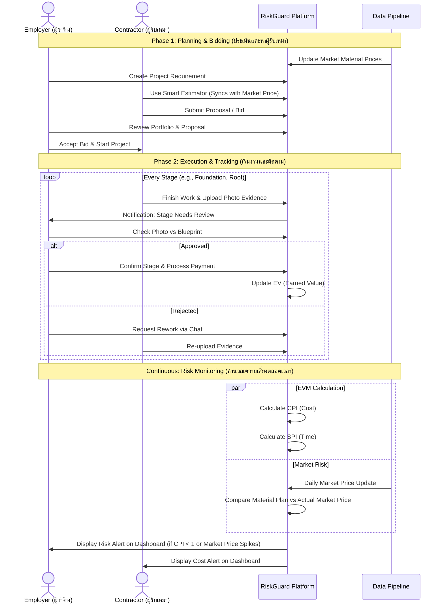

```mermaid
sequenceDiagram
    actor E as Employer (ผู้ว่าจ้าง)
    actor C as Contractor (ผู้รับเหมา)
    participant RG as RiskGuard Platform
    participant DP as Data Pipeline

    %% Phase 1: Planning & Bidding
    Note over E, DP: Phase 1: Planning & Bidding (ประเมินและหาผู้รับเหมา)
    DP->>RG: Update Market Material Prices
    E->>RG: Create Project Requirement
    C->>RG: Use Smart Estimator (Syncs with Market Price)
    C->>RG: Submit Proposal / Bid
    E->>RG: Review Portfolio & Proposal
    E->>C: Accept Bid & Start Project

    %% Phase 2: Execution & Tracking
    Note over E, DP: Phase 2: Execution & Tracking (เริ่มงานและติดตาม)
    loop Every Stage (e.g., Foundation, Roof)
        C->>RG: Finish Work & Upload Photo Evidence
        RG->>E: Notification: Stage Needs Review
        E->>RG: Check Photo vs Blueprint
        alt Approved
            E->>RG: Confirm Stage & Process Payment
            RG->>RG: Update EV (Earned Value)
        else Rejected
            E->>RG: Request Rework via Chat
            C->>RG: Re-upload Evidence
        end
    end

    %% Phase 3: Monitoring
    Note over E, DP: Continuous: Risk Monitoring (คำนวณความเสี่ยงตลอดเวลา)
    par EVM Calculation
        RG->>RG: Calculate CPI (Cost)
        RG->>RG: Calculate SPI (Time)
    and Market Risk
        DP->>RG: Daily Market Price Update
        RG->>RG: Compare Material Plan vs Actual Market Price
    end
    RG->>E: Display Risk Alert on Dashboard (if CPI < 1 or Market Price Spikes)
    RG->>C: Display Cost Alert on Dashboard
```